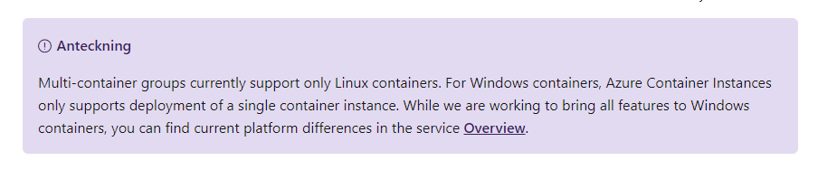

# ACIWordCount
Lab project on containers and logic apps

## Base
[ACI wordcount](https://hub.docker.com/_/microsoft-azuredocs-aci-wordcount) on Linux & python

## Plan
* Create windows server [nano container running powershell 7](https://hub.docker.com/_/microsoft-powershell)
  * Accept optional url input for input
  * output result in json
* Create logic ap and trigger by webhook

## Action

```docker
docker build --tag nanocountwords:v1 .
docker run --env-file env.list  nanocountwords:v1
docker start -it --isolation=hyperv bebb0fe7abe3 cmd
docker rm $(docker ps -aq)
docker run --env MinimumLength=10 nanocountwords:v4
docker rmi $(docker images nanoc* -q)
```
### run
```powershell
docker run --env-file env.list  nanocountwords:v6 | ConvertFrom-Json | Select-Object -ExpandProperty Data
```
### output
```
Count Name
----- ----
  120 CLAUDIUS
  119 POLONIUS
   95 GERTRUDE
   76 ROSENCRANTZ
   64 GUILDENSTERN
```

## Azure

### ACR

#### ACR access
```yaml
Login server: acrpihl.azurecr.io
Registry name: acrpihl
Password: -
```

```
az acr build -t countwords:v1 -r acrpihl  --platform windows -f dockerfile .
```

```yaml
2020/06/20 08:26:52
- image:
    registry: .azurecr.io
    repository: countwords
    tag: v1
    digest: sha256:bb9388546fe5b79018830f39357d3879cea73ff4e07747277669673043ab043c
  runtime-dependency:
    registry: mcr.microsoft.com
    repository: powershell
    tag: 7.0.2-nanoserver-1909
    digest: sha256:c501dabddadf45086a0c83e6e6b9808624a572b2973addefaee6703965a2d2b9
  git: {}
Run ID: cg1 was successful after 1m34s
```
#### Docker image in ACR
```
docker pull acrpihl.azurecr.io/countwords:v1
```
#### ACI
Error;
```json
{
    "code": "DeploymentFailed",
    "message": "At least one resource deployment operation failed. Please list deployment operations for details. Please see https://aka.ms/DeployOperations for usage details.",
    "details": [
        {
            "code": "BadRequest",
            "message": "{\r\n \"error\": {\r\n \"code\": \"UnsupportedWindowsVersion\",\r\n \"message\": \"Unsupported windows image version. Supported versions are 'Windows Server 2016 - Before 2B, Windows Server 2019 - Before 2B, Windows Server 2016 - After 2B, Windows Server 2019 - After 2B'\"\r\n }\r\n}"
        }
    ]
}
```
Changed base image to lts-nanoserver-1809 and deployment in ACI completed

## Findings
Logic apps only support ACI *groups*. ACI groups only sopports Linux containers.


Cached images in [azure](https://docs.microsoft.com/en-us/rest/api/container-instances/listcachedimages/listcachedimages) for quicker startups